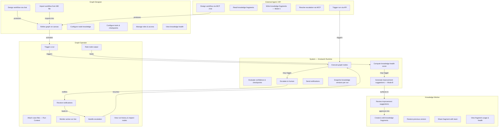
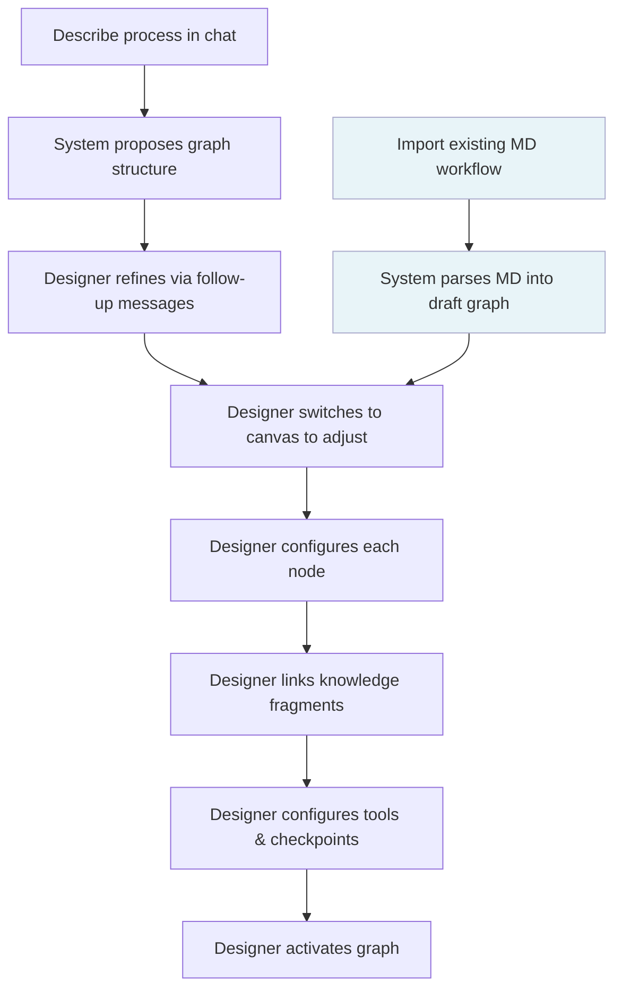
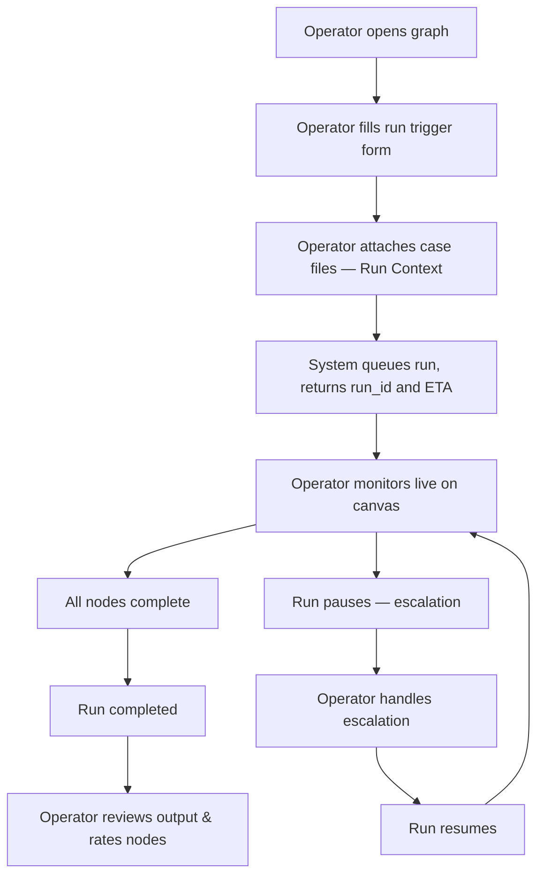
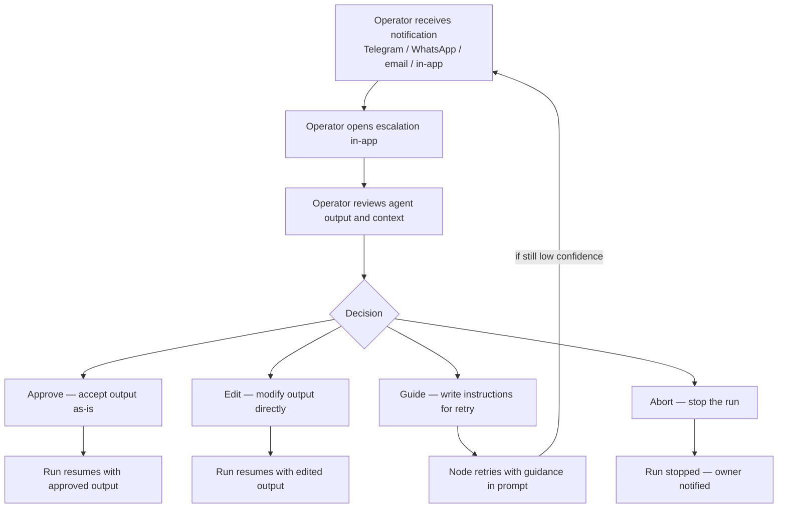
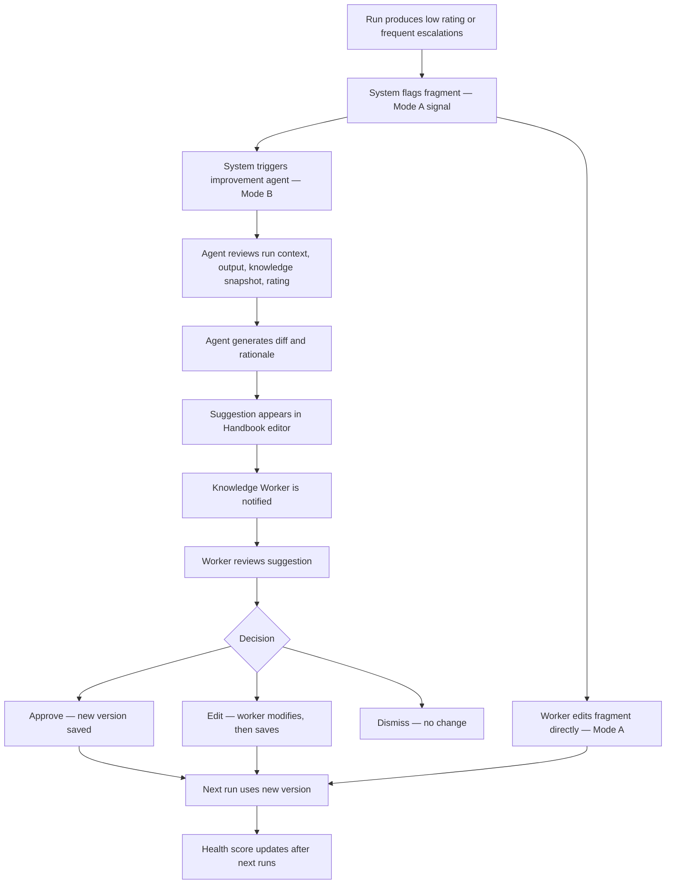
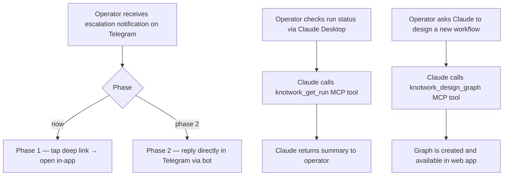
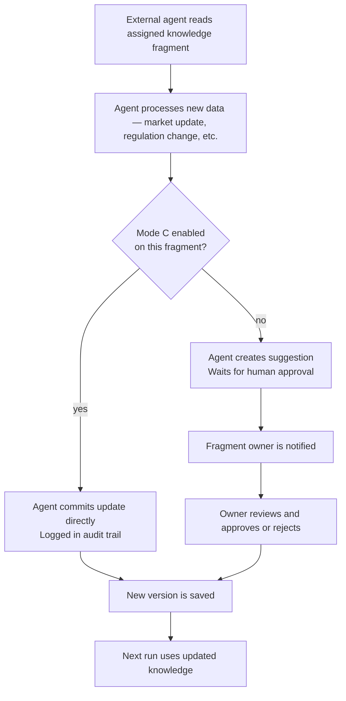

# Use Cases

## Actors

| Actor | Description |
|-------|-------------|
| **Graph Designer** | Builds and edits workflows. Configures nodes, knowledge, tools, access. Usually the team lead or process owner. |
| **Graph Operator** | Runs workflows daily. Handles escalations, rates outputs. May be the same person as the Designer in small teams. |
| **Knowledge Worker** | Owns and maintains specific knowledge fragments. May be an internal employee or an external agent. |
| **External Agent** | An automated system (Claude, custom agent, MCP client) granted access to read or write knowledge, or trigger runs. |
| **System** | The Knotwork runtime — LangGraph engine, notification dispatcher, health scorer. |

---

## System Overview

---

## Use Case 1: Design a Workflow

**Primary actor:** Graph Designer
**Goal:** Create a working agent graph from scratch or from an existing document

**Alternate path:** Designer pastes an existing MD document (e.g. an n8n flow description, a process SOP). The system scaffolds the graph from it. The designer reviews and adjusts on the canvas rather than starting from scratch.

---

## Use Case 2: Execute a Run

**Primary actor:** Graph Operator
**Goal:** Run a workflow on a specific case and get a result

---

## Use Case 3: Handle an Escalation

**Primary actor:** Graph Operator
**Goal:** Review an agent's uncertain or flagged output and decide what to do

---

## Use Case 4: Improve Knowledge

**Primary actor:** Knowledge Worker (+ System for Mode B suggestions)
**Goal:** Improve a knowledge fragment based on run feedback

---

## Use Case 5: Operate via Chat (MCP)

**Primary actor:** Graph Operator using Telegram, WhatsApp, or Claude Desktop
**Goal:** Perform any operational action without opening the web app

---

## Use Case 6: External Agent as Knowledge Worker

**Primary actor:** External Agent (via API key + MCP)
**Goal:** Keep a knowledge fragment up to date autonomously

