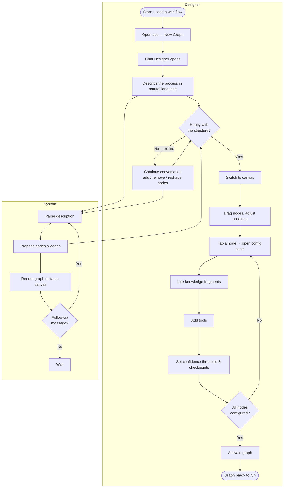
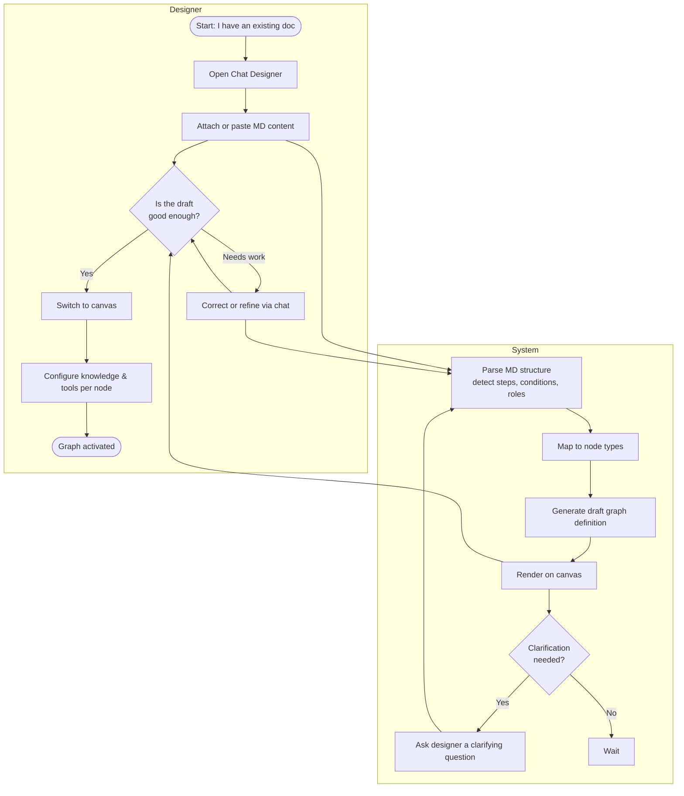
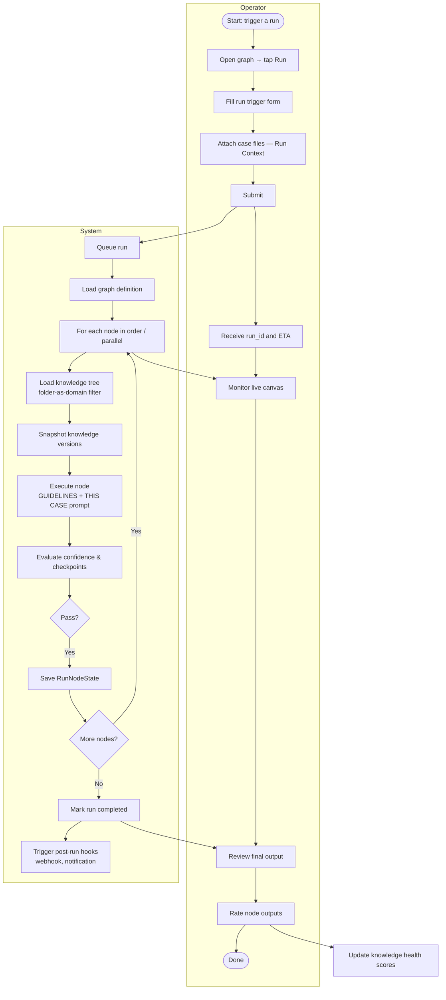
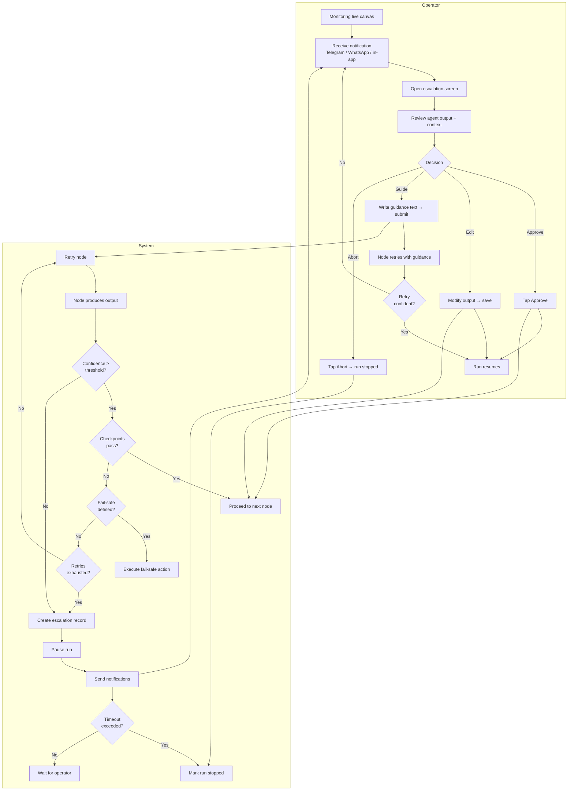
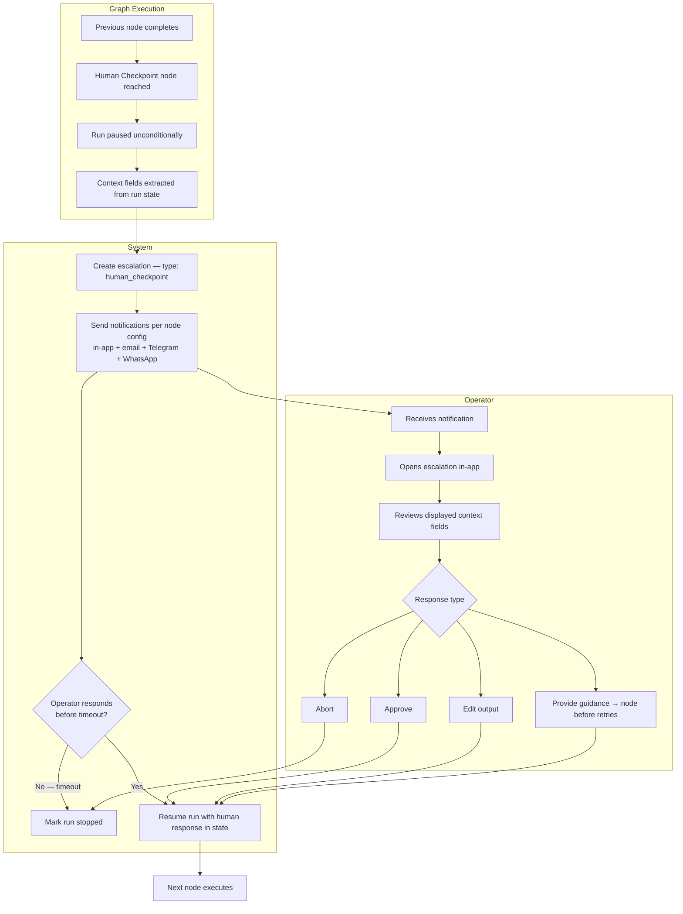
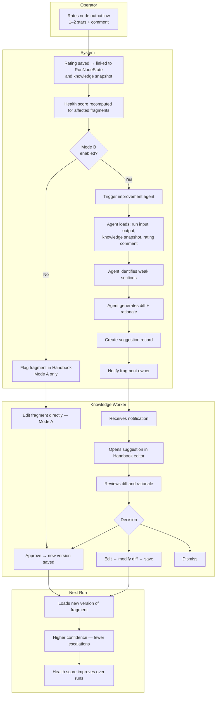
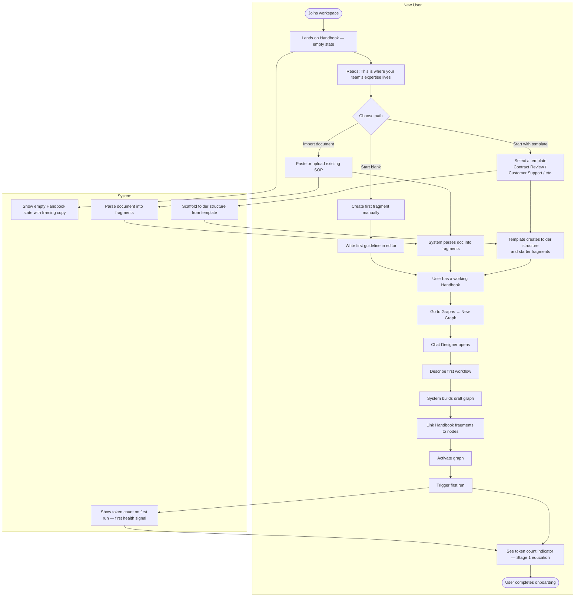
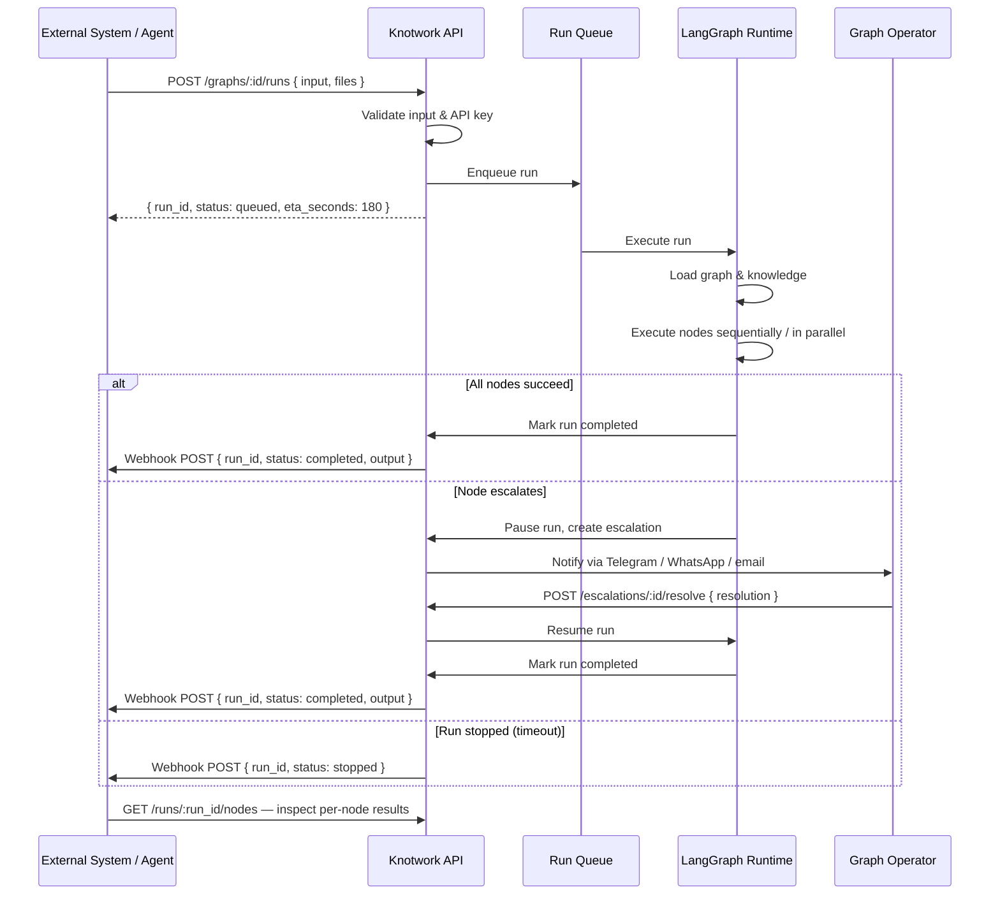
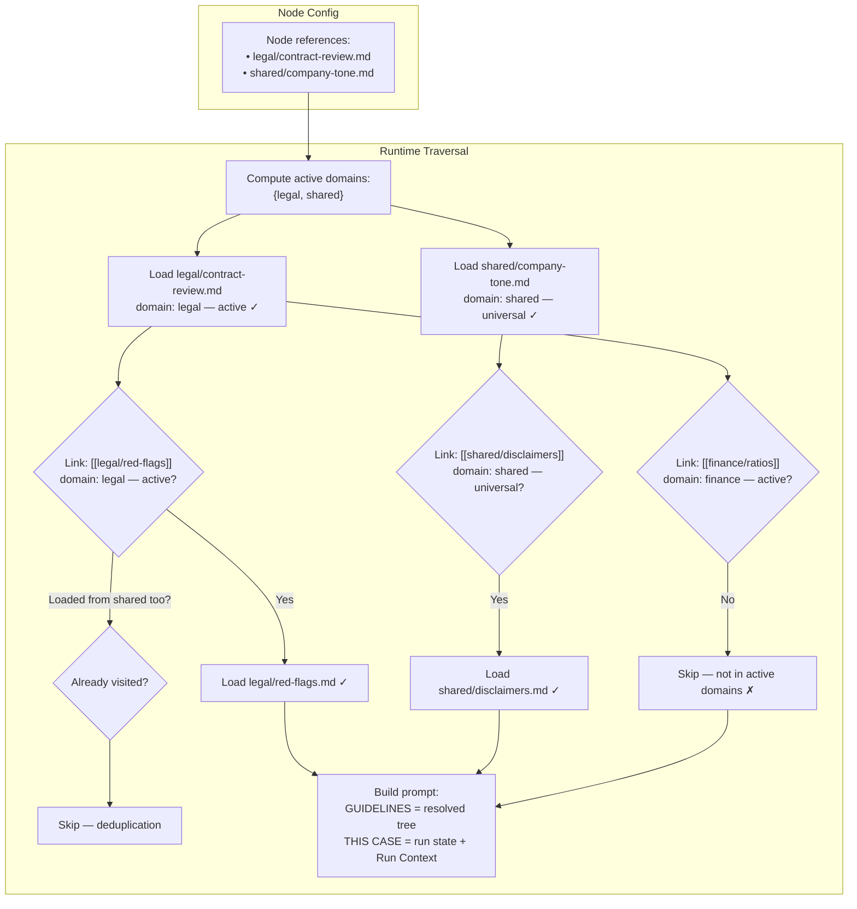

# Activity Diagrams

Key flows shown as swimlane activity diagrams. Swimlanes are rendered as subgraphs.

---

## 1. Design a Workflow (Chat-First)

From a new user's first idea to an active graph ready to run.

---

## 2. Import Workflow from Existing Document

For users who already have a process described as an MD file, SOP document, or even an n8n flow description.

---

## 3. Execute a Run (Normal Path — No Escalation)

---

## 4. Execute a Run (Escalation Path)

---

## 5. Human Checkpoint Node

A planned stop — always requires human action, regardless of confidence.

---

## 6. Knowledge Improvement Loop

From a low-rated run to an improved knowledge fragment and better future runs.

---

## 7. Onboarding a New User

First-time experience that establishes the "Handbook first" mental model before the user ever builds a graph.

---

## 8. Run Triggered via API / External System

For automated pipelines where no human triggers the run manually.

---

## 9. Knowledge Domain Traversal

How the runtime loads knowledge fragments while respecting folder domains — preventing a legal node from loading finance content.

