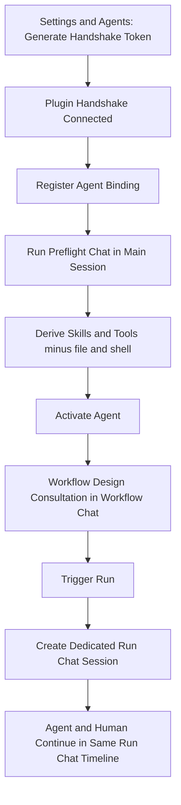

# Session 8 Quickstart: Chat-First Agent Flow

## Goal

Use chat as the single runtime surface:
- preflight is a chat,
- workflow design consultation is a separate per-workflow chat,
- each run is its own chat session.

---

## User Journey

---

## What user must always see

1. Main session chat per agent.
2. Preflight ask/reply transcript in main session chat.
3. Unified Skills & Tools list (no file/shell).
4. Workflow design consultation transcript in workflow chat.
5. Run chat session with both agent and human messages.
6. Escalation question and human resolution in same run chat.

---

## Related docs

- [S8 spec](/Users/hieu/Work/crea8r/knotwork/docs/implementation/S8/spec.md)
- [S8 validation](/Users/hieu/Work/crea8r/knotwork/docs/implementation/S8/validation.md)
- [Roadmap](/Users/hieu/Work/crea8r/knotwork/docs/implementation/roadmap.md)
