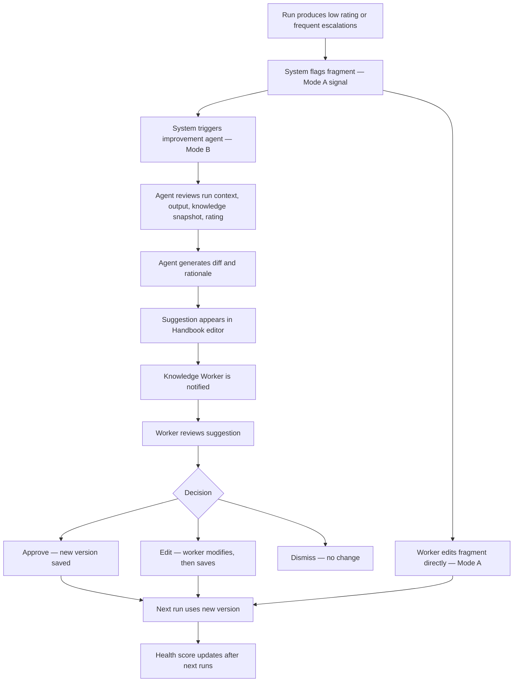
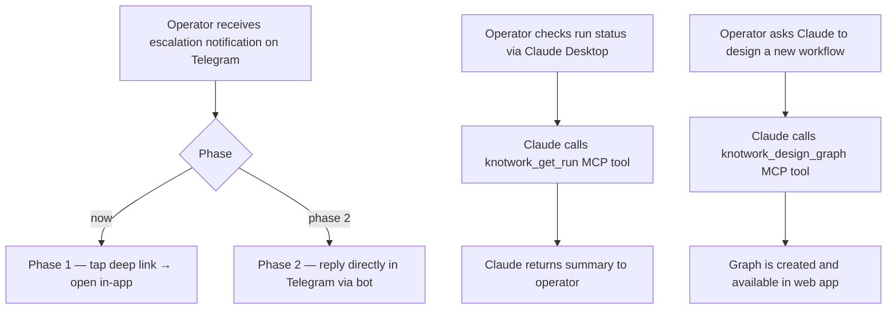
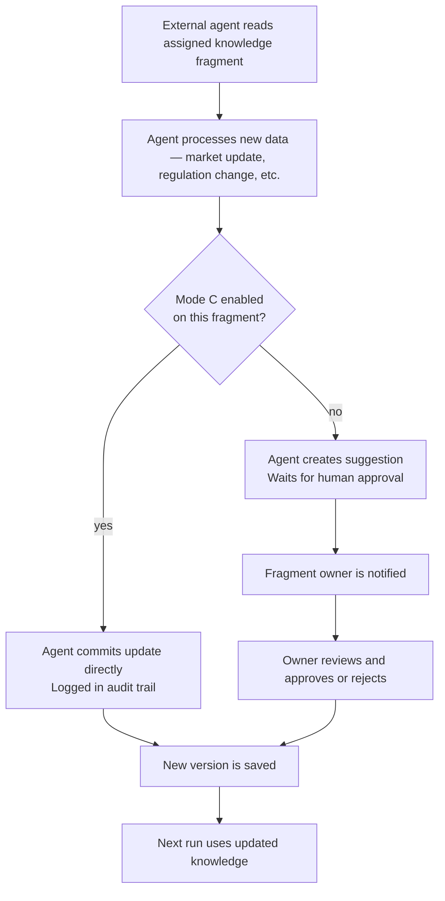

# Use Cases — Advanced

## Use Case 4: Improve Knowledge

**Primary actor:** Knowledge Worker (+ System for Mode B suggestions)
**Goal:** Improve a knowledge fragment based on run feedback

---

## Use Case 5: Operate via Chat (MCP)

**Primary actor:** Graph Operator using Telegram, WhatsApp, or Claude Desktop
**Goal:** Perform any operational action without opening the web app

---

## Use Case 6: External Agent as Knowledge Worker

**Primary actor:** External Agent (via ed25519 auth + JWT + MCP)
**Goal:** Keep a knowledge fragment up to date autonomously

