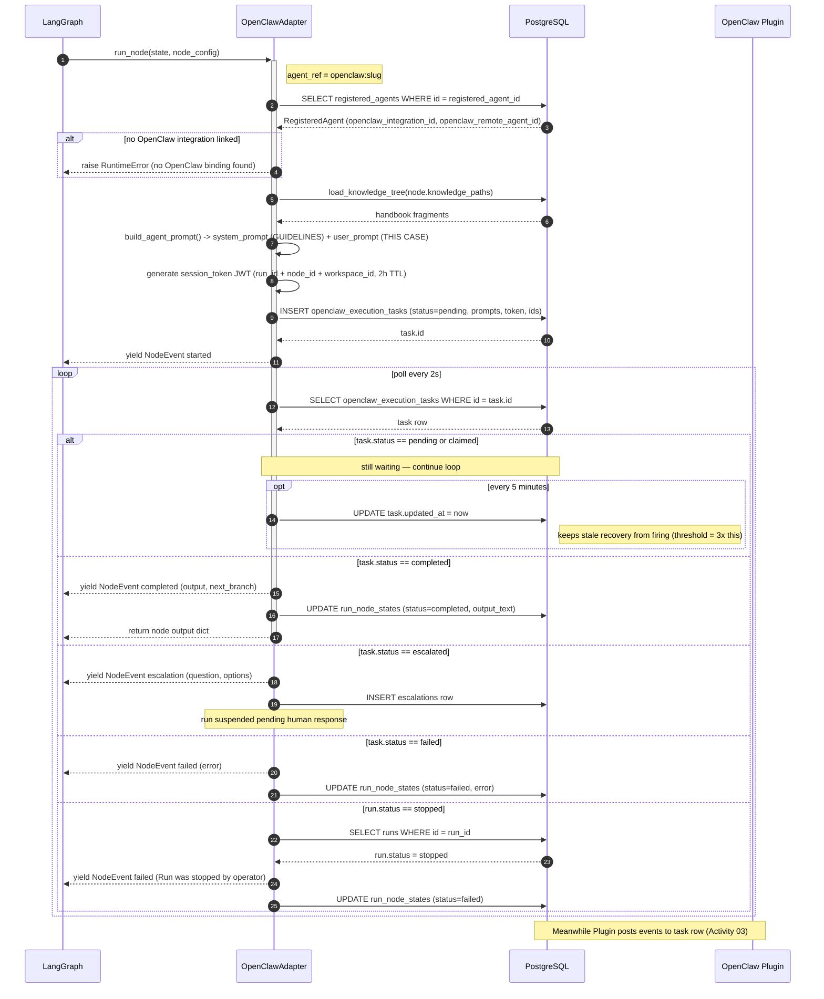

# Activity 05 — Adapter Polling (Knotwork Runtime Side)

The Knotwork side of the integration. The `OpenClawAdapter` is the LangGraph node implementation for `agent_ref = "openclaw:*"`. It creates the task row and polls it until the OpenClaw plugin posts a result.

This is a **planned adapter** — the pattern follows `runtime/adapters/base.py` and the existing `ClaudeAdapter`/`OpenAIAdapter` implementations. The adapter will live at `backend/knotwork/runtime/adapters/openclaw.py`.

---

## Sequence Diagram



---

## Input

### From LangGraph `RunState`
```python
{
  "run_id": UUID,
  "workspace_id": UUID,
  "node_id": str,
  "run_input": dict,
  "node_outputs": dict[str, str],   # outputs from prior nodes
  "knowledge_snapshot": dict,
}
```

### From node config (`NodeDef.config`)
```python
{
  "agent_ref": "openclaw:my-agent",
  "registered_agent_id": "uuid",     # links to RegisteredAgent row
  "system_prompt": "...",            # appended after GUIDELINES
  "knowledge_paths": ["legal/sop.md"],
  "input_sources": ["run_input", "node_a"],  # null = all
  "trust_level": "supervised",
}
```

### From DB
- `RegisteredAgent` row (via `registered_agent_id`) — provides `openclaw_integration_id`, `openclaw_remote_agent_id`
- `OpenClawIntegration` row — confirms integration is active

---

## Output

### Written to DB

| Table | Row | What |
|---|---|---|
| `openclaw_execution_tasks` | INSERT | Full task: prompts, session_token, IDs, `status=pending` |
| `run_node_states` | UPDATE | `status`, `output_text`, `error` (written by node on completion) |

### Yielded `NodeEvent` stream

```python
NodeEvent(type="started", payload={...})
# ... (plugin heartbeat log events forwarded to run debug panel)
NodeEvent(type="completed", payload={"output": "...", "next_branch": "..."})
# or
NodeEvent(type="escalation", payload={"question": "...", "options": [...]})
# or
NodeEvent(type="failed", payload={"error": "..."})
```

Source (pattern): [`runtime/adapters/base.py`](../../../../../../backend/knotwork/runtime/adapters/base.py), [`runtime/adapters/claude.py`](../../../../../../backend/knotwork/runtime/adapters/claude.py)

---

## Files Read

None directly. All data comes from the DB and in-memory `RunState`.

## DB Tables Read

| Table | Purpose | Source |
|---|---|---|
| `registered_agents` | Resolve `openclaw_integration_id` + `openclaw_remote_agent_id` | `registered_agents/models.py` |
| `openclaw_integrations` | Confirm integration exists + not deleted | `openclaw_integrations/models.py` |
| `openclaw_execution_tasks` | Poll for status change | `openclaw_integrations/models.py` |
| `knowledge_files` (via storage adapter) | Load handbook fragments for prompt | `knowledge/service.py` |
| `runs` | Check `run.status` for operator stop | `runs/models.py` |

## DB Tables Written

| Table | Operation | When |
|---|---|---|
| `openclaw_execution_tasks` | INSERT | Before yielding `started` |
| `openclaw_execution_tasks` | UPDATE `updated_at` | Every 5 min (heartbeat touch) |
| `run_node_states` | UPDATE | On completion/failure |

---

## Adapter Heartbeat

While waiting, the adapter touches `task.updated_at` every 5 minutes:

```python
# Prevents stale recovery (15 min threshold) from misfiring on live tasks.
# 5 min × 3 = 15 min threshold in service.py:plugin_pull_task L506
if time.time() - last_touch > 300:
    task.updated_at = now()
    await db.commit()
    last_touch = time.time()
```

The 15-minute stale recovery threshold is exactly 3× this interval. As long as the adapter process is alive and touching the row, the stale recovery will never fire.

Source: [`service.py:plugin_pull_task L502`](../../../../../../backend/knotwork/openclaw_integrations/service.py#L502) (documents the 3× relationship)

---

## Prompt Construction

The system prompt and user prompt are built using the standard Knotwork prompt infrastructure before the task row is created:

```python
# runtime/prompt_builder.py
system_prompt = build_agent_prompt(
    knowledge_tree=load_knowledge_tree(node.knowledge_paths),
    system_prompt_override=node.config.get("system_prompt"),
)
# → "=== GUIDELINES ===\n<handbook fragments>\n\n=== THIS CASE ===\n<run input + prior outputs>"
```

The system prompt is the `GUIDELINES` section (handbook). The user prompt is the `THIS CASE` section (run input + prior node outputs filtered by `input_sources`).

Source: [`runtime/prompt_builder.py`](../../../../../../backend/knotwork/runtime/prompt_builder.py), [`runtime/knowledge_loader.py`](../../../../../../backend/knotwork/runtime/knowledge_loader.py)

---

## Relation to Other Activities

- Task is **written** here → picked up by [Activity 03 (poll loop)](../plugin/poll-loop.md)
- Result row is **read** here → written by [Activity 03 (poll loop)](../plugin/poll-loop.md) via [Activity 04 (task execution)](../plugin/task-execution.md)
- `updated_at` touched here → prevents [Activity 06 (stale recovery)](./stale-recovery.md) from firing
- `run.status` checked here → see [Activity 07 (error recovery)](../plugin/error-recovery.md) for operator stop
