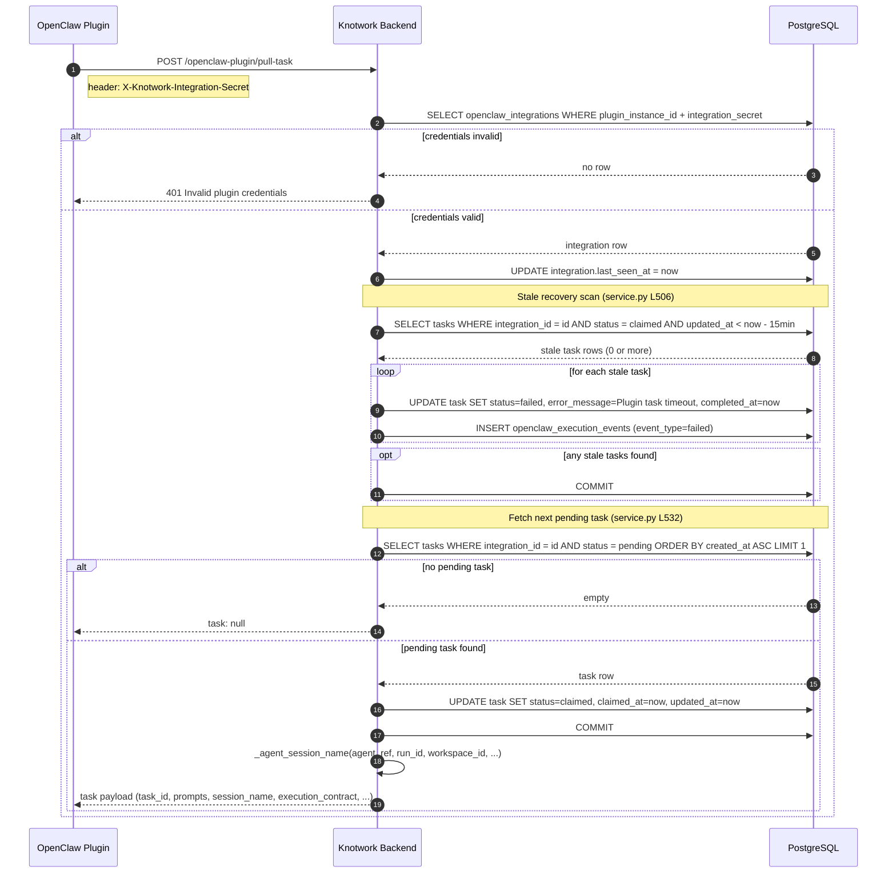

# Activity 06 — Stale Task Recovery

A safety net that fires on every `pull-task` call. Its purpose: if both the Knotwork adapter **and** the OpenClaw plugin go silent for 15 minutes (e.g. both processes crashed), tasks stuck in `claimed` are automatically marked `failed` so the run doesn't hang indefinitely.

This activity runs **inside** `plugin_pull_task` before fetching the next pending task. It is triggered by the plugin's regular poll — not by a separate cron.

---

## Sequence Diagram



---

## When It Fires

Every call to `POST /openclaw-plugin/pull-task`, regardless of whether a task is found. The stale scan always runs first.

Source: [`service.py:plugin_pull_task L495`](../../../../../../backend/knotwork/openclaw_integrations/service.py#L495)

---

## The 15-Minute Threshold

The 15-minute threshold is not arbitrary — it is exactly **3× the adapter heartbeat interval**:

```
Adapter touches task.updated_at every 5 minutes.
15 min = 5 min × 3.
```

As long as the Knotwork adapter is running, it keeps `updated_at` fresh, and the stale scan never triggers. The scan only fires when **both** the adapter AND the plugin have been completely silent for 15 minutes — the "double crash" scenario.

Source: [`service.py:plugin_pull_task comment L502`](../../../../../../backend/knotwork/openclaw_integrations/service.py#L502)

```python
# Recover tasks stuck in claimed (plugin crashed or command hang) so UX does not stall forever.
# Threshold is 15 min — 3× the adapter heartbeat interval (5 min). As long as the
# Knotwork adapter is alive it touches task.updated_at every 5 min, so this recovery
# only fires when both the adapter AND the plugin have been silent for 15 min.
stale_before = _now() - timedelta(minutes=15)
```

---

## Input

### DB query
```sql
SELECT * FROM openclaw_execution_tasks
WHERE integration_id = <this_integration_id>
  AND status = 'claimed'
  AND updated_at < now() - interval '15 minutes'
```

---

## Output

### DB writes (per stale task)

| Table | Operation | What |
|---|---|---|
| `openclaw_execution_tasks` | UPDATE | `status=failed`, `error_message`, `completed_at`, `updated_at` |
| `openclaw_execution_events` | INSERT | `event_type=failed`, `payload={error: "Plugin task timeout..."}` |

Source: [`service.py L514`](../../../../../../backend/knotwork/openclaw_integrations/service.py#L514)

### Cascade to run state

Stale recovery **does not** cascade to `RunNodeState` or `Run`. That cascade only happens in `plugin_submit_task_event` for explicitly submitted `failed` events.

The Knotwork adapter polling loop (Activity 05) will detect `task.status = "failed"` on its next poll and handle the `RunNodeState` update itself — unless the adapter has also crashed, in which case the arq 24h job timeout is the final safety net.

---

## Files Read / Written

This activity touches only DB tables — no filesystem.

## DB Tables Read

| Table | Query |
|---|---|
| `openclaw_integrations` | `resolve_plugin_integration` — validate secret |
| `openclaw_execution_tasks` | Scan for stale `claimed` rows |

## DB Tables Written

| Table | Operation |
|---|---|
| `openclaw_integrations` | UPDATE `last_seen_at` |
| `openclaw_execution_tasks` | UPDATE `status=failed` + timestamps |
| `openclaw_execution_events` | INSERT `failed` event |

---

## Relation to Other Timeouts

| Mechanism | Threshold | Protects against |
|---|---|---|
| Stale recovery | 15 min since `updated_at` | Both adapter + plugin crash |
| `agent.wait` timeout | 15 min | OpenClaw agent hanging inside a run |
| arq job timeout | 24 hours | Hung `execute_run` arq task |
| Operator stop | On demand | Manual cancellation |

See [Activity 07](../plugin/error-recovery.md) for how the plugin handles recovery on its side.
