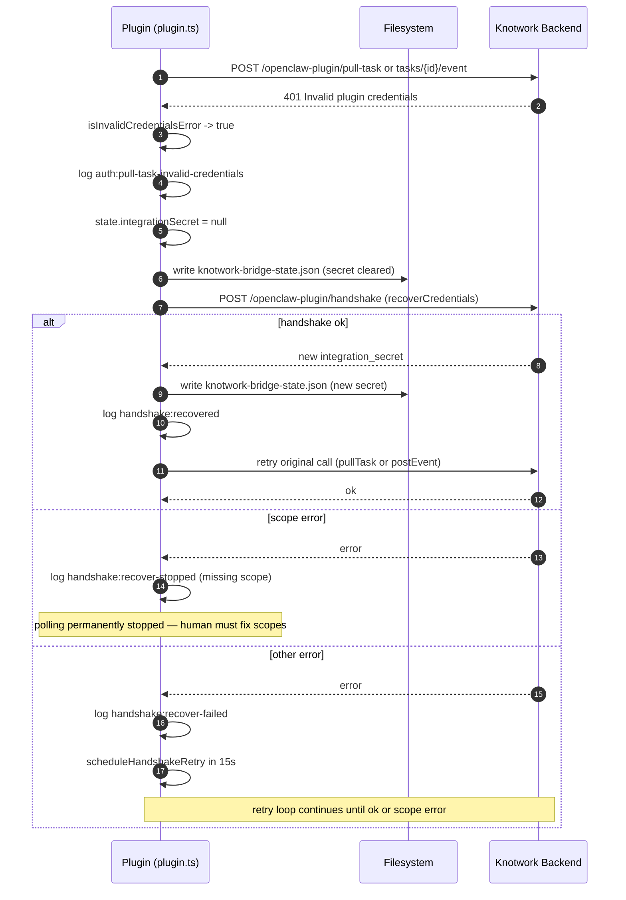
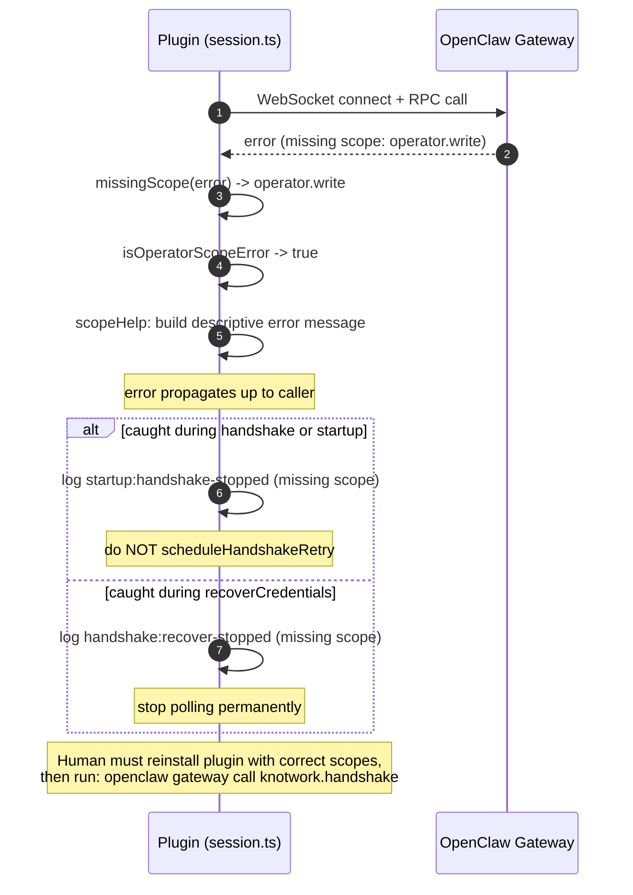
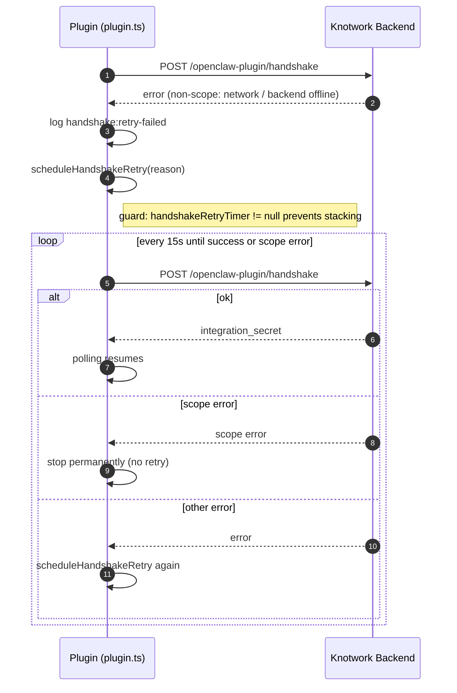
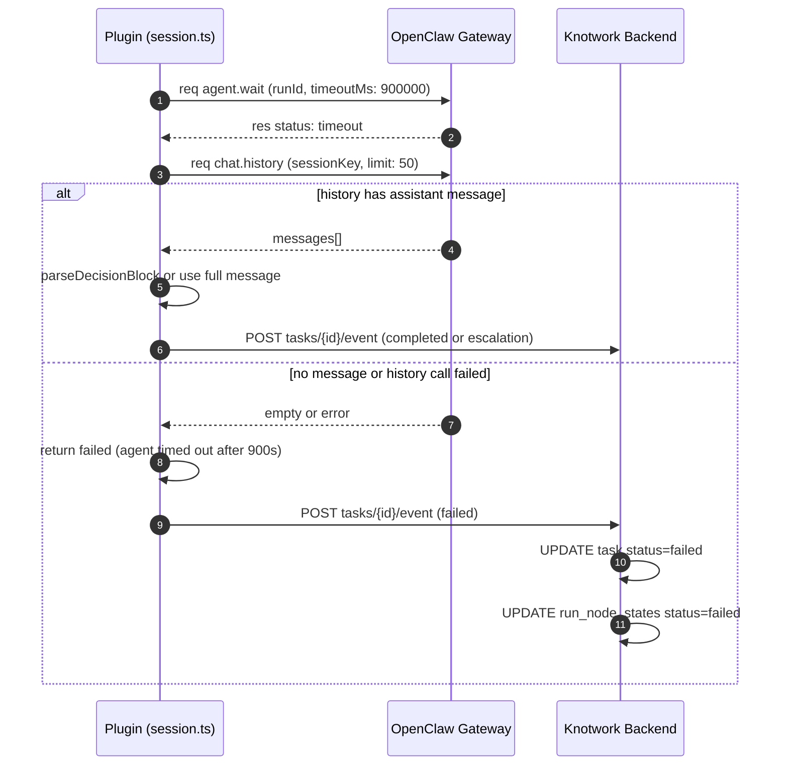
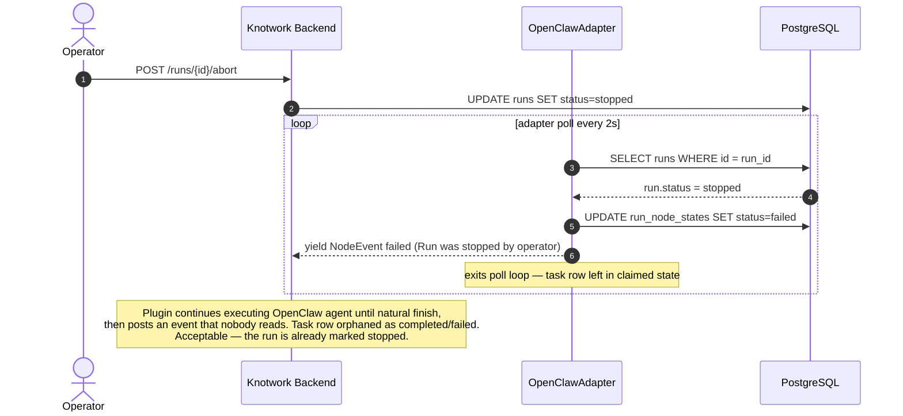
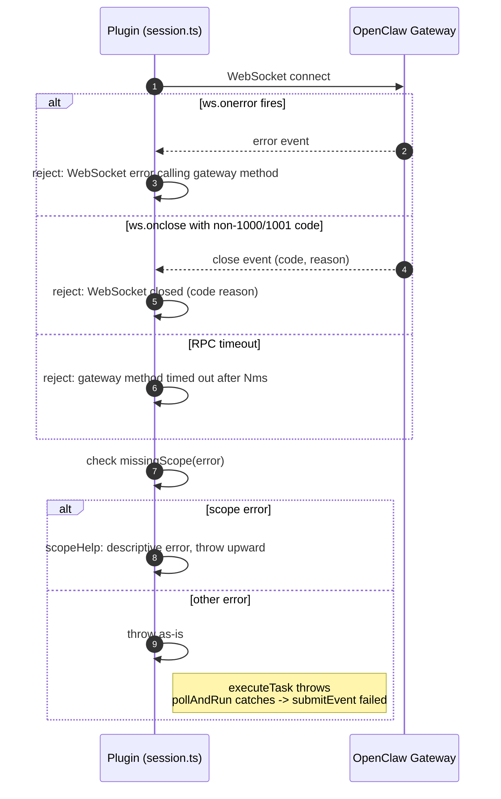

# Activity 07 — Error Recovery

How the plugin handles the different failure modes: invalid credentials, missing gateway scopes, execution timeouts, and operator stops.

---

## 401 — Credential Recovery

Happens when the backend rejects the plugin's `integration_secret`. The plugin clears the stale secret and immediately attempts a fresh handshake.

Source: [`plugin.ts:recoverCredentials`](../../../../../../plugins/openclaw/src/plugin.ts#L311), [`plugin.ts:pollAndRun L356`](../../../../../../plugins/openclaw/src/plugin.ts#L356)

---

## Missing Scope Error

Happens when the OpenClaw gateway denies an RPC call because `operator.read` or `operator.write` was not granted. Requires human intervention — no automatic recovery.

Source: [`openclaw/scope.ts:missingScope`](../../../../../../plugins/openclaw/src/openclaw/scope.ts#L30), [`openclaw/scope.ts:isOperatorScopeError`](../../../../../../plugins/openclaw/src/openclaw/scope.ts#L38), [`lifecycle/handshake.ts:scheduleHandshakeRetry`](../../../../../../plugins/openclaw/src/lifecycle/handshake.ts)

---

## Handshake Retry Loop

When a handshake fails for a non-scope reason (network down, backend offline), the plugin retries every 15 seconds until it succeeds.

Source: [`plugin.ts:scheduleHandshakeRetry`](../../../../../../plugins/openclaw/src/plugin.ts#L266)

---

## Execution Timeout

When `agent.wait` returns `timeout` after 15 minutes, the plugin tries to read the chat history as a fallback before declaring failure.

Source: [`openclaw/session.ts:executeTask`](../../../../../../plugins/openclaw/src/openclaw/session.ts)

---

## Operator Stop

When an operator clicks "Stop run", `run.status` is set to `stopped`. The adapter detects this on its next poll (Activity 05).

---

## Gateway WebSocket Errors

Source: [`openclaw/gateway.ts:gatewayRpc`](../../../../../../plugins/openclaw/src/openclaw/gateway.ts)

---

## Summary: What Requires Human Intervention

| Error | Auto-recovery | Human action needed |
|---|---|---|
| 401 Invalid credentials | Yes — re-handshakes automatically | Only if `handshakeToken` is also expired or revoked |
| Missing scope | No — stops permanently | Reinstall plugin with `operator.read` + `operator.write` scopes |
| Backend unreachable | Yes — retries every 15s | Only if backend stays down indefinitely |
| `agent.wait` timeout | Partial — tries chat.history | Check OpenClaw agent for hang; consider task-size reduction |
| arq 24h timeout | No | Investigate stuck run; restart worker |
| Operator stop | N/A (intentional) | None |

---

## Files Read / Written

| File | When | Operation |
|---|---|---|
| `~/.openclaw/knotwork-bridge-state.json` | On credential reset | WRITE: clear `integrationSecret` |
| `~/.openclaw/knotwork-bridge-state.json` | After successful recovery handshake | WRITE: new `integrationSecret` + `lastHandshakeAt` |

Source: [`plugin.ts:resetPersistedSecret`](../../../../../../plugins/openclaw/src/plugin.ts#L253), [`plugin.ts:persistState`](../../../../../../plugins/openclaw/src/plugin.ts#L180)

## DB Tables Written (backend — on failed event)

| Table | Operation | Source |
|---|---|---|
| `openclaw_execution_tasks` | UPDATE `status=failed`, `error_message`, `completed_at` | `service.py:plugin_submit_task_event` (L630) |
| `openclaw_execution_events` | INSERT `event_type=failed` | `service.py:plugin_submit_task_event` (L606) |
| `run_node_states` | UPDATE `status=failed`, `error` | `service.py:plugin_submit_task_event` (L636) |
| `runs` | UPDATE `status=failed`, `error` | `service.py:plugin_submit_task_event` (L652) |
