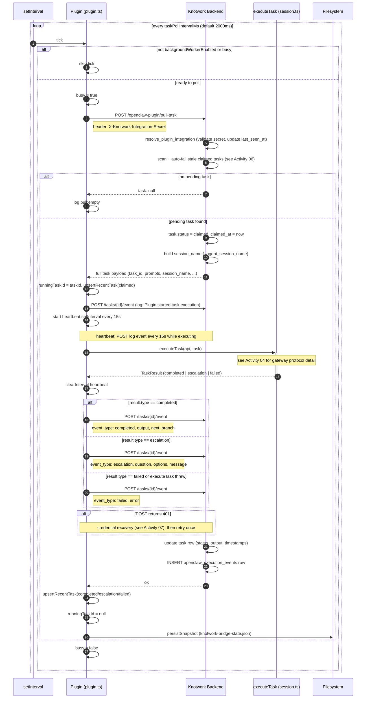

# Activity 03 — Task Poll Loop

The steady-state loop that keeps the plugin connected to Knotwork. Runs on the primary runtime process (the one that holds the lease). Fires every `taskPollIntervalMs` (default: 2 seconds). One task at a time — a `busy` flag prevents concurrent execution.

See [Activity 04](./task-execution.md) for what happens inside `executeTask`.
See [Activity 06](../knotwork/stale-recovery.md) for how stale tasks are recovered during `pull-task`.
See [Activity 07](./error-recovery.md) for 401 / credential recovery.

---

## Sequence Diagram



---

## Input

### From poll timer
- `taskPollIntervalMs` from config (default: 2000ms, minimum: 500ms clamped at L635)

Source: [`plugin.ts`](../../../../../../openclaw-plugin-knotwork/src/plugin.ts)

### From in-memory state
```typescript
state.pluginInstanceId   // required
state.integrationSecret  // required
state.backgroundWorkerEnabled  // must be true
```

### Task payload returned by backend
```typescript
// types.ts:ExecutionTask
{
  task_id: string
  node_id?: string
  run_id?: string
  workspace_id?: string
  agent_key?: string
  remote_agent_id?: string
  session_name?: string
  system_prompt?: string
  user_prompt?: string
}
```

Source: [`types.ts:ExecutionTask`](../../../../../../openclaw-plugin-knotwork/src/types.ts#L73), [`service.py:plugin_pull_task L562`](../../../../../../backend/knotwork/openclaw_integrations/service.py#L562)

---

## Output

### Event posted to backend

**On completion:**
```json
{
  "plugin_instance_id": "...",
  "event_type": "completed",
  "payload": { "output": "...", "next_branch": null }
}
```

**On escalation:**
```json
{
  "plugin_instance_id": "...",
  "event_type": "escalation",
  "payload": { "question": "...", "options": ["Approve", "Reject"], "message": "..." }
}
```

**On failure:**
```json
{
  "plugin_instance_id": "...",
  "event_type": "failed",
  "payload": { "error": "..." }
}
```

**Heartbeat (every 15s during execution):**
```json
{
  "event_type": "log",
  "payload": {
    "entry_type": "progress",
    "content": "OpenClaw is still working (heartbeat 3)",
    "metadata": { "heartbeat": 3, "node_id": "...", "run_id": "..." }
  }
}
```

Source: [`lifecycle/worker.ts:pollAndRun`](../../../../../../openclaw-plugin-knotwork/src/lifecycle/worker.ts), [`openclaw/bridge.ts:postEvent`](../../../../../../openclaw-plugin-knotwork/src/openclaw/bridge.ts)

---

## Files Read

None directly. Config is already loaded into `state` and `cfg` in memory.

## Files Written

| File | When | What |
|---|---|---|
| `~/.openclaw/knotwork-bridge-state.json` | After every event post + on task finish | Updated `recentTasks`, `runningTaskId`, `lastTaskAt`, `logs` |

Source: [`lifecycle/worker.ts:upsertRecentTask`](../../../../../../openclaw-plugin-knotwork/src/lifecycle/worker.ts), [`plugin.ts:persistSnapshot`](../../../../../../openclaw-plugin-knotwork/src/plugin.ts)

## DB Tables Written (backend — during pull-task)

| Table | Operation | Source |
|---|---|---|
| `openclaw_integrations` | UPDATE `last_seen_at` | `service.py:resolve_plugin_integration` (L489) |
| `openclaw_execution_tasks` | UPDATE `status=claimed`, `claimed_at` | `service.py:plugin_pull_task` (L543) |
| `openclaw_execution_tasks` | UPDATE status + result fields | `service.py:plugin_submit_task_event` (L591) |
| `openclaw_execution_events` | INSERT per event | `service.py:plugin_submit_task_event` (L606) |

---

## Concurrency

The `busy` flag in [`plugin.ts`](../../../../../../openclaw-plugin-knotwork/src/plugin.ts) ensures only one task runs at a time, and the `integrationSecret` guard prevents any polling before handshake completes:

```typescript
let busy = false
setInterval(() => {
  // no-op until backgroundWorkerEnabled=true AND integrationSecret is set
  if (!state.backgroundWorkerEnabled || !state.integrationSecret || busy) return
  busy = true
  pollAndRun()
    .catch(...)
    .finally(() => { busy = false })
}, pollMs)
```

This means: if a task takes 10 minutes, the next `pull-task` call doesn't happen until that task completes. Multiple tasks accumulate in the `pending` queue on the backend and are processed serially.

---

## Session name format

Built by the backend at `service.py:_agent_session_name` ([L47](../../../../../../backend/knotwork/openclaw_integrations/service.py#L47)):

```
knotwork:<agent-key>:<workspace-id>:run:<run_id>   ← for workflow runs
knotwork:<agent-key>:<workspace-id>:main           ← for main agent chat
knotwork:<agent-key>:<workspace-id>:handbook        ← for handbook sessions
```

The `agent_key` is the `RegisteredAgent.id` UUID if the agent is registered, otherwise the slug portion of `agent_ref` (e.g. `"openclaw:my-agent"` → `"my-agent"`).

Source: [`service.py:plugin_pull_task L548`](../../../../../../backend/knotwork/openclaw_integrations/service.py#L548)
