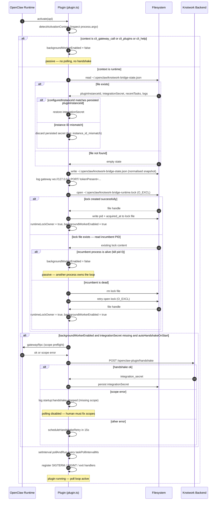

# Activity 02 — Plugin Startup

Happens every time OpenClaw starts or loads the plugin. The plugin must load persisted state, determine whether it is the primary runtime (lease), optionally auto-handshake, then start the background poll loop.

Key constraint: **only one process runs the poll loop at a time**. Multiple OpenClaw contexts (CLI calls, plugin-list commands) all invoke `activate()`, but only the `runtime` context acquires the lease and starts background work.

---

## Sequence Diagram



---

## Input

### From OpenClaw runtime
- `api: OpenClawApi` — the OpenClaw plugin API object passed to `activate()`
- `process.argv` — used to detect activation context

Source: [`plugin.ts:activate`](../../../../../../openclaw-plugin-knotwork/src/plugin.ts#L43), [`plugin.ts:detectActivationContext`](../../../../../../openclaw-plugin-knotwork/src/plugin.ts#L124)

### From filesystem
- `~/.openclaw/knotwork-bridge-state.json` — persisted state from previous run
- `~/.openclaw/knotwork-bridge-runtime.lock` — runtime lease mutex

### From config (`~/.openclaw/openclaw.json` via `api.config`)
- `gateway.port` / `OPENCLAW_GATEWAY_PORT` — WebSocket gateway port (default: 18789)
- `gateway.auth.token` / `OPENCLAW_GATEWAY_TOKEN` — auth token for gateway
- `plugins.entries.knotwork-bridge.config.taskPollIntervalMs` — poll interval (default: 2000ms)

Source: [`bridge.ts:getGatewayConfig`](../../../../../../openclaw-plugin-knotwork/src/bridge.ts#L60), [`bridge.ts:getConfig`](../../../../../../openclaw-plugin-knotwork/src/bridge.ts#L30)

---

## Output

### In-memory `PluginState`

```typescript
// types.ts:PluginState
{
  pluginInstanceId: string | null
  integrationSecret: string | null
  stateFilePath: string | null
  runtimeLockPath: string | null
  activationContext: string | null       // "runtime" | "cli_gateway_call" | ...
  backgroundWorkerEnabled: boolean       // true only for runtime context with lease
  lastHandshakeAt: string | null
  lastHandshakeOk: boolean
  lastError: string | null
  lastTaskAt: string | null
  runningTaskId: string | null
  runtimeLeaseOwnerPid: number | null
  recentTasks: RecentTask[]
  logs: string[]
}
```

Source: [`types.ts:PluginState`](../../../../../../openclaw-plugin-knotwork/src/types.ts#L97)

### Files written

| File | When | What |
|---|---|---|
| `~/.openclaw/knotwork-bridge-state.json` | After state load (`stateHydrated = true`) | Normalised state snapshot |
| `~/.openclaw/knotwork-bridge-runtime.lock` | On lease acquisition | `{ pid, acquired_at, plugin_id }` |

Source: [`plugin.ts:persistSnapshot`](../../../../../../openclaw-plugin-knotwork/src/plugin.ts#L157), [`plugin.ts:acquireRuntimeLease`](../../../../../../openclaw-plugin-knotwork/src/plugin.ts#L214)

---

## Files Read

| File | Read by | Purpose |
|---|---|---|
| `~/.openclaw/knotwork-bridge-state.json` | `plugin.ts:readPersistedState` (L132) | Recover credentials + history across restarts |
| `~/.openclaw/knotwork-bridge-runtime.lock` | `plugin.ts:acquireRuntimeLease` (L235) | Read incumbent PID to check if process is still alive |
| `~/.openclaw/openclaw.json` *(via OpenClaw api)* | `bridge.ts:getConfig` (L30), `bridge.ts:getGatewayConfig` (L60) | Read plugin config + gateway port/token |

---

## Files Written

| File | Written by | What |
|---|---|---|
| `~/.openclaw/knotwork-bridge-state.json` | `plugin.ts:persistSnapshot` (L157) | Serialised `PluginState` (all fields) |
| `~/.openclaw/knotwork-bridge-runtime.lock` | `plugin.ts:acquireRuntimeLease` (L222) | `{ pid, acquired_at, plugin_id }` JSON |

---

## Runtime Lease Detail

The lease uses `open(path, 'wx')` — the `x` flag means "fail if file exists". This gives mutual exclusion without an external lock service.

On lease acquisition failure, the incumbent PID is checked with `process.kill(pid, 0)`. If the process is dead (throws ESRCH), the stale lock is removed and acquisition retries.

On clean exit (`SIGTERM`, `SIGINT`, `process.exit`), the lock file is removed. On crash, the next startup detects the dead PID and cleans up.

Source: [`plugin.ts:acquireRuntimeLease`](../../../../../../openclaw-plugin-knotwork/src/plugin.ts#L214), [`plugin.ts:releaseRuntimeLease`](../../../../../../openclaw-plugin-knotwork/src/plugin.ts#L184), [`plugin.ts:releaseRuntimeLeaseSync`](../../../../../../openclaw-plugin-knotwork/src/plugin.ts#L194)

---

## Log Lines (for debugging)

```
startup:background-disabled context=cli_gateway_call  ← passive context
startup:background-disabled runtime_lease=busy        ← another process owns the lease
startup:background-enabled context=runtime            ← this process owns the lease
gateway: ws://127.0.0.1:18789/ tokenPresent=true      ← always emitted for diagnostics
state:loaded secret=...xxxx                           ← persisted secret restored
state:ignored persisted secret due_to_instance_id_mismatch=true
startup:handshake-failed <error>
startup:handshake-stopped reason=missing_required_operator_scope
```

All lines written to: stdout + `state.logs` ring buffer (last 200 lines).

Source: [`plugin.ts:log`](../../../../../../openclaw-plugin-knotwork/src/plugin.ts#L66)
