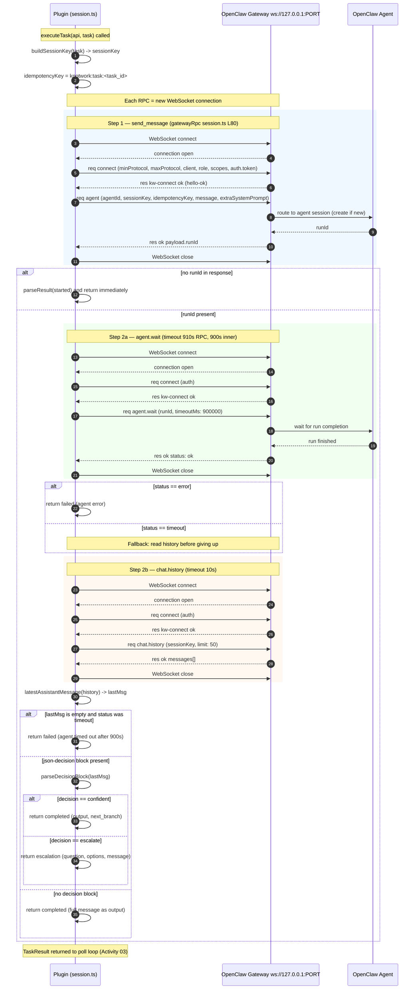

# Activity 04 — Task Execution

What happens inside `executeTask` in `session.ts`. This is the core of the integration: driving an OpenClaw agent via the local gateway WebSocket to produce a result that Knotwork can use.

The gateway protocol is low-level: each RPC call opens a new WebSocket connection, handshakes, makes one call, and closes. There is no persistent connection.

---

## Sequence Diagram



---

## Input

### `ExecutionTask` (from pull-task response)

```typescript
// types.ts:ExecutionTask
{
  task_id: string
  node_id?: string
  run_id?: string
  workspace_id?: string
  agent_key?: string          // used in session key construction
  remote_agent_id?: string    // agentId sent to gateway
  session_name?: string       // canonical session name from backend
  system_prompt?: string      // built by build_agent_prompt() on backend
  user_prompt?: string        // run state + context
}
```

Source: [`types.ts:ExecutionTask`](../../../../../../openclaw-plugin-knotwork/src/types.ts#L73)

### From config (runtime)
- `OPENCLAW_GATEWAY_PORT` — WebSocket port (default: 18789)
- `OPENCLAW_GATEWAY_TOKEN` — gateway auth token

Source: [`bridge.ts:getGatewayConfig`](../../../../../../openclaw-plugin-knotwork/src/bridge.ts#L60)

---

## Output

```typescript
// types.ts:TaskResult
type TaskResult =
  | { type: 'completed'; output: string; next_branch: string | null }
  | { type: 'escalation'; question: string; options: string[]; message?: string }
  | { type: 'failed'; error: string }
```

Source: [`types.ts:TaskResult`](../../../../../../openclaw-plugin-knotwork/src/types.ts#L114)

---

## Files Read / Written

`executeTask` itself reads and writes no files. All I/O is in-memory WebSocket calls.

The caller (`pollAndRun` in `plugin.ts`) writes `knotwork-bridge-state.json` after the result is obtained.

---

## WebSocket Wire Protocol

Each call to `gatewayRpc` opens a **new** WebSocket connection. The protocol has two steps:

**Step 1 — Connect**
```json
→ { "type": "req", "id": "kw-connect", "method": "connect", "params": {
    "minProtocol": 1,
    "maxProtocol": 3,
    "client": { "id": "gateway-client", "displayName": "knotwork-bridge", "mode": "backend" },
    "role": "operator",
    "scopes": ["operator.read", "operator.write"],
    "auth": { "token": "<OPENCLAW_GATEWAY_TOKEN>" }
  }
}
← { "type": "res", "id": "kw-connect", "ok": true, "payload": { ... } }
```

**Step 2 — Actual RPC**
```json
→ { "type": "req", "id": "<random>", "method": "<method>", "params": { ... } }
← { "type": "res", "id": "<random>", "ok": true, "payload": { ... } }
  or
← { "type": "res", "id": "<random>", "ok": false, "error": { ... } }
```

Server-pushed `"type": "event"` frames (connect.challenge, tick) are **ignored**.

Source: [`session.ts:gatewayRpc`](../../../../../../openclaw-plugin-knotwork/src/session.ts#L80)

---

## Session Key Construction

```typescript
// session.ts:buildSessionKey L164
// session.ts:fallbackKey L173
sessionKey = "agent:<agentId>:<knotworkKey>"
// where knotworkKey = task.session_name ?? fallback
// fallback = "knotwork:<slug>:<workspace>:run:<run_id>"
```

The `session_name` comes from the backend. It is deterministic — same run/node always produces the same key. This means **retrying a task resumes the same OpenClaw chat session**, with the same conversation history.

The `idempotencyKey = "knotwork:task:<task_id>"` prevents duplicate messages if `agent` is called twice for the same task.

Source: [`session.ts:buildSessionKey`](../../../../../../openclaw-plugin-knotwork/src/session.ts#L164), [`session.ts:idempotencyKey`](../../../../../../openclaw-plugin-knotwork/src/session.ts#L181)

---

## Decision Block Protocol

The OpenClaw agent signals completion by appending a structured block at the **end** of its final message:

**Confident completion:**
````
```json-decision
{"decision": "confident", "output": "The answer is X", "next_branch": null}
```
````

**Escalation:**
````
```json-decision
{"decision": "escalate", "question": "Approve spend of $500?", "options": ["Approve", "Reject"]}
```
````

`parseDecisionBlock` finds the **last** occurrence of the ` ```json-decision ` fence. Prose before the fence is preserved as `message` on escalation (displayed in the run debug panel) or as the fallback `output` if the `output` field is empty.

If no block is present, the **full message** is treated as a confident completion.

Source: [`session.ts:parseDecisionBlock`](../../../../../../openclaw-plugin-knotwork/src/session.ts#L203)

---

## Timeouts

| Step | Timeout | Set at |
|---|---|---|
| `agent` RPC (send message) | 90 seconds (default) | [`session.ts:rpc L264`](../../../../../../openclaw-plugin-knotwork/src/session.ts#L264) |
| `agent.wait` RPC | 910 seconds (15 min + 10s buffer) | `AGENT_WAIT_RPC_TIMEOUT_MS` at [`session.ts L12`](../../../../../../openclaw-plugin-knotwork/src/session.ts#L12) |
| `chat.history` RPC | 10 seconds | [`session.ts L305`](../../../../../../openclaw-plugin-knotwork/src/session.ts#L305) |

The `agent.wait` gateway call internally uses `timeoutMs: 900_000` (15 min) — sent in the params to the gateway. On `status: "timeout"`, the plugin falls back to reading `chat.history` directly before declaring failure.

Source: [`session.ts:executeTask L254`](../../../../../../openclaw-plugin-knotwork/src/session.ts#L254)
