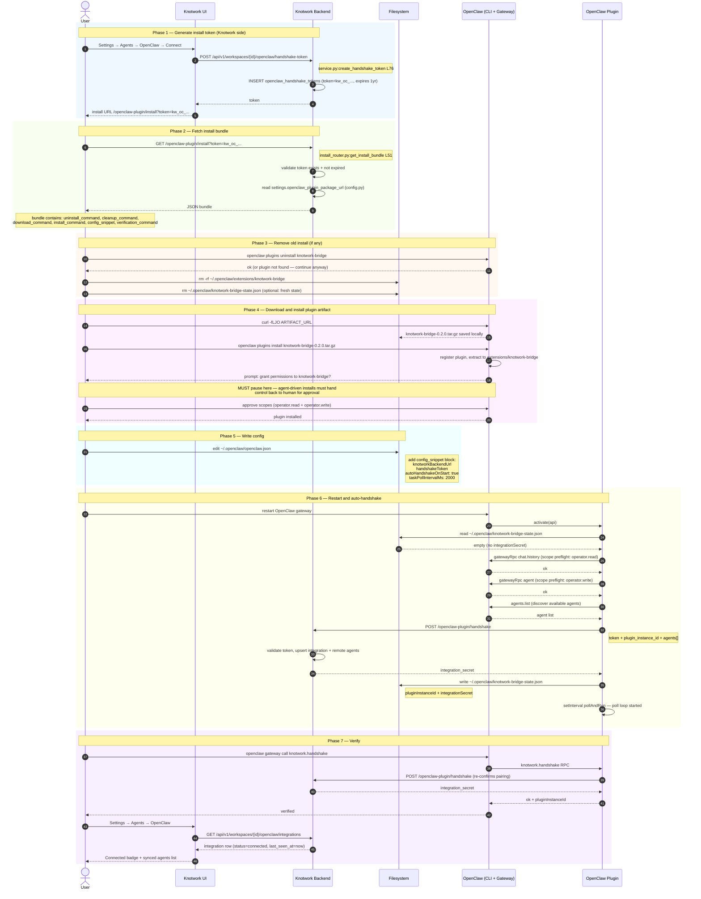

# Activity 08 — Install

Full end-to-end install sequence: from generating a token in Knotwork to a verified, running plugin. This is the happy path. For what happens after the plugin starts, see [Activity 02 (Plugin Startup)](../plugin/startup.md) and [Activity 01 (Pairing)](./pairing.md).

---

## Sequence Diagram

---

## Failure Conditions

The install is considered failed if any of these are true after Phase 7:

| Condition | Cause | Fix |
|---|---|---|
| `openclaw gateway call knotwork.handshake` returns missing-scope error | Scopes not granted during permission approval | Reinstall and approve `operator.read` + `operator.write` |
| `plugin not found: knotwork-bridge` | Standard installer did not complete | Re-run `openclaw plugins install <file>` |
| Plugin starts without `knotworkBackendUrl` or `handshakeToken` | Config not written to `~/.openclaw/openclaw.json` | Re-apply `config_snippet`, restart gateway |
| Knotwork UI shows no integration | Handshake POST never reached backend | Check `knotworkBackendUrl` in config; verify network |

Source: [`install_router.py:get_install_bundle L148`](../../../../../../backend/knotwork/openclaw_integrations/install_router.py#L148) — `installation_failure_conditions` list in bundle response.

---

## Files Read

| File | Phase | Who reads | Purpose |
|---|---|---|---|
| `~/.openclaw/openclaw.json` | 6 | Plugin via `bridge.ts:getConfig` (L30) | Read `knotworkBackendUrl`, `handshakeToken`, `taskPollIntervalMs` |
| `~/.openclaw/knotwork-bridge-state.json` | 6 | `plugin.ts:readPersistedState` (L132) | Check for existing `integrationSecret` |

## Files Written

| File | Phase | Who writes | What |
|---|---|---|---|
| `~/.openclaw/openclaw.json` | 5 | User (manual edit) | `config_snippet` block with backend URL + token |
| `~/.openclaw/knotwork-bridge-state.json` | 6 | `plugin.ts:persistSnapshot` (L157) | `pluginInstanceId` + `integrationSecret` |
| `~/.openclaw/knotwork-bridge-runtime.lock` | 6 | `plugin.ts:acquireRuntimeLease` (L214) | `{ pid, acquired_at }` |
| `~/.openclaw/extensions/knotwork-bridge/` | 4 | OpenClaw installer | Plugin bundle (extracted from `.tar.gz`) |

## DB Tables Written (backend)

| Table | Phase | Operation | Source |
|---|---|---|---|
| `openclaw_handshake_tokens` | 1 | INSERT | `service.py:create_handshake_token` (L76) |
| `openclaw_integrations` | 6 | INSERT | `service.py:plugin_handshake` (L142) |
| `openclaw_remote_agents` | 6 | INSERT per agent | `service.py:plugin_handshake` (L166) |
| `openclaw_handshake_tokens` | 6 | UPDATE `used_at` | `service.py:plugin_handshake` (L204) |
