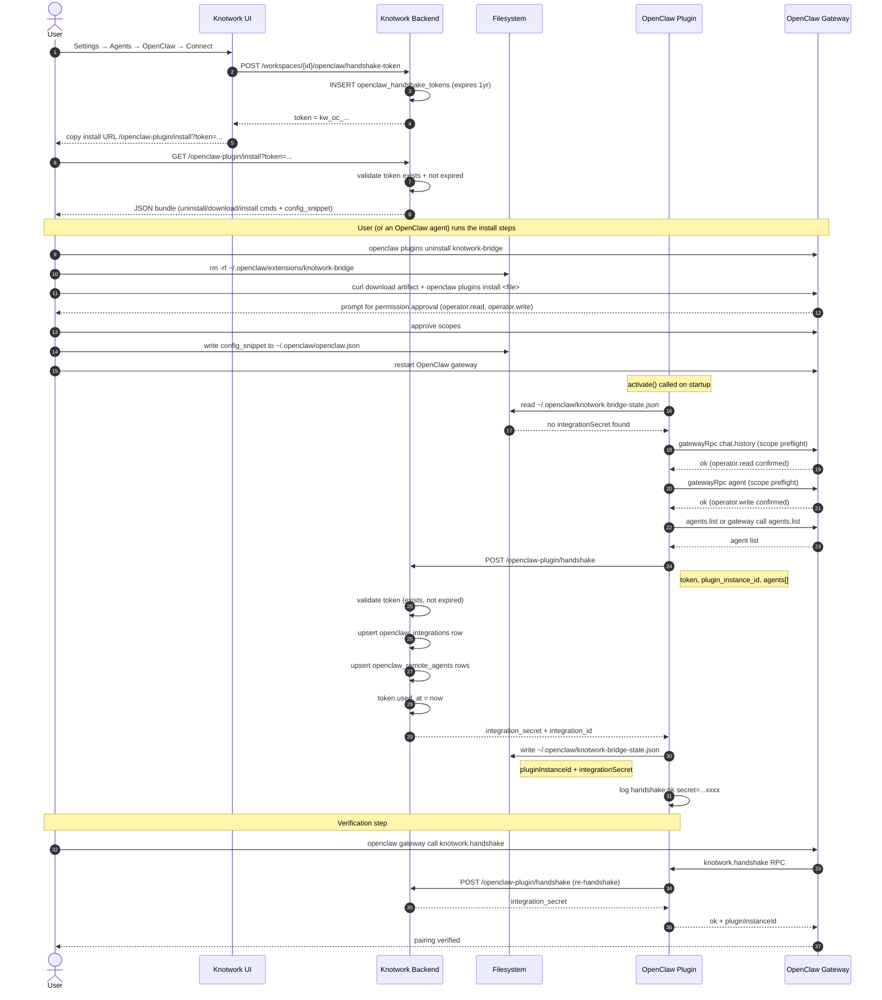

# Activity 01 — Pairing

One-time process that links an OpenClaw plugin instance to a Knotwork workspace. After pairing, the plugin has an `integration_secret` it can use for all subsequent API calls. Pairing does **not** need to be repeated unless you disconnect or the secret is invalidated.

---

## Sequence Diagram



---

## Input

### From user/Knotwork UI
- User action: click Connect in Settings → Agents → OpenClaw

### From plugin config (`~/.openclaw/openclaw.json`)
```json
{
  "plugins": { "entries": { "knotwork-bridge": {
    "config": {
      "knotworkBackendUrl": "https://...",
      "handshakeToken": "kw_oc_...",
      "autoHandshakeOnStart": true
    }
  }}}
}
```
Source: [`bridge.ts:getConfig`](../../../../../../openclaw-plugin-knotwork/src/bridge.ts#L30) — merges `api.pluginConfig`, `api.config.plugins.entries`, and env vars.

### From plugin (sent to backend at handshake)
```json
{
  "token": "kw_oc_...",
  "plugin_instance_id": "knotwork-abc123",
  "plugin_version": "0.2.0",
  "agents": [
    {
      "remote_agent_id": "main",
      "slug": "main",
      "display_name": "Main Agent",
      "tools": [],
      "constraints": {}
    }
  ]
}
```
Source: [`bridge.ts:doHandshake`](../../../../../../openclaw-plugin-knotwork/src/bridge.ts#L179)

---

## Output

### From backend to plugin
```json
{
  "integration_id": "uuid",
  "workspace_id": "uuid",
  "accepted": true,
  "synced_agents": 1,
  "integration_secret": "kwoc_..."
}
```
Source: [`service.py:plugin_handshake`](../../../../../../backend/knotwork/openclaw_integrations/service.py#L207) returns `PluginHandshakeResponse`.

### Written by plugin
- `~/.openclaw/knotwork-bridge-state.json` — persists `pluginInstanceId` + `integrationSecret`

Source: [`plugin.ts:persistSnapshot`](../../../../../../openclaw-plugin-knotwork/src/plugin.ts#L157)

---

## Files Read

| File | Who reads | What for |
|---|---|---|
| `~/.openclaw/knotwork-bridge-state.json` | `plugin.ts:readPersistedState` (L132) | Recover `integrationSecret` + `pluginInstanceId` across restarts |
| `~/.openclaw/openclaw.json` | OpenClaw runtime → `bridge.ts:getConfig` (L30) | Read `knotworkBackendUrl`, `handshakeToken`, `pluginInstanceId` |

## Files Written

| File | Who writes | What |
|---|---|---|
| `~/.openclaw/knotwork-bridge-state.json` | `plugin.ts:persistSnapshot` (L157) | `pluginInstanceId`, `integrationSecret`, `lastHandshakeAt`, `lastHandshakeOk` |

## DB Tables Written (backend)

| Table | Operation | Source |
|---|---|---|
| `openclaw_handshake_tokens` | INSERT (token creation) | `service.py:create_handshake_token` (L76) |
| `openclaw_handshake_tokens` | UPDATE `used_at` | `service.py:plugin_handshake` (L204) |
| `openclaw_integrations` | INSERT or UPDATE | `service.py:plugin_handshake` (L142) |
| `openclaw_remote_agents` | INSERT or UPDATE per agent | `service.py:plugin_handshake` (L166) |

---

## Agent Discovery (plugin side)

Before calling `doHandshake`, the plugin discovers available OpenClaw agents via a four-step fallback:

```
1. api.agents.list()           ← SDK method (preferred)
2. gateway.call('agents.list') ← gateway RPC
3. gateway.call('agent.list')  ← alternate name
4. config.agents.list          ← static config
5. default stub: [{ remote_agent_id: 'main', slug: 'main' }]
```

Source: [`bridge.ts:discoverAgents`](../../../../../../openclaw-plugin-knotwork/src/bridge.ts#L117)

The discovered agents are sent in the handshake payload and persisted as `OpenClawRemoteAgent` rows.

---

## Scope Pre-flight

Before sending the handshake, the plugin probes the OpenClaw gateway for required scopes:

```typescript
// session.ts:verifyGatewayOperatorScopes
await rpc('chat.history', {})  // probes operator.read
await rpc('agent', {})         // probes operator.write
```

Source: [`session.ts:verifyGatewayOperatorScopes`](../../../../../../openclaw-plugin-knotwork/src/session.ts#L328)

If either probe returns a scope error, `isOperatorScopeError` returns true and the startup stops with a clear error message. Any non-scope error (business-logic rejection) is treated as proof the scope was granted.

Source: [`session.ts:isOperatorScopeError`](../../../../../../openclaw-plugin-knotwork/src/session.ts#L62)

---

## Re-pairing

If the `integrationSecret` is invalidated (backend returns 401), the plugin automatically clears it and re-handshakes. Manual re-handshake:

```bash
openclaw gateway call knotwork.handshake
```

Source: [`plugin.ts` RPC handler `knotwork.handshake`](../../../../../../openclaw-plugin-knotwork/src/plugin.ts#L538)

To fully reset (useful after reconnecting to a different workspace):

```bash
openclaw gateway call knotwork.reset_connection
```

Source: [`plugin.ts` RPC handler `knotwork.reset_connection`](../../../../../../openclaw-plugin-knotwork/src/plugin.ts#L552)
