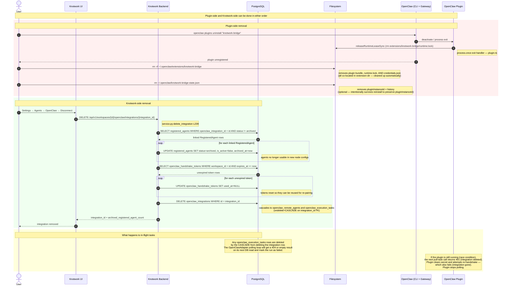

# Activity 09 — Uninstall

How to fully remove the OpenClaw integration. Uninstall has two independent sides — plugin-side (OpenClaw machine) and Knotwork-side (backend/DB) — and they can be done in either order. Doing both is required for a clean removal.

---

## Sequence Diagram

---

## What Gets Deleted vs Preserved

| Item | On plugin uninstall | On Knotwork DELETE integration |
|---|---|---|
| `~/.openclaw/extensions/knotwork-bridge/` | Removed by `openclaw plugins uninstall` + `rm -rf` (includes `runtime.lock` + `credentials.json`) | Not touched |
| `~/.openclaw/knotwork-bridge-state.json` | **Not auto-removed** — persists `pluginInstanceId` for re-install. Delete manually only if fully removing the integration. | Not touched |
| `openclaw_integrations` row | Not touched | **Deleted** |
| `openclaw_remote_agents` rows | Not touched | **Deleted** (CASCADE) |
| `openclaw_execution_tasks` rows | Not touched | **Deleted** (CASCADE) |
| `openclaw_execution_events` rows | Not touched | **Deleted** (CASCADE) |
| `registered_agents` rows (provider=openclaw) | Not touched | **Archived** (status=archived, not deleted) |
| `openclaw_handshake_tokens` rows | Not touched | `used_at` reset to NULL (reusable) |
| Workflow node configs referencing the agent | Not touched | Node still references `registered_agent_id` — runtime will fail when node runs |

---

## Partial Uninstall Scenarios

**Plugin removed but Knotwork integration not deleted:**
- The `openclaw_integrations` row stays. Knotwork UI still shows the integration as connected.
- Any new tasks written to `openclaw_execution_tasks` will sit `pending` forever — no plugin is polling.
- The 15-minute stale recovery (Activity 06) can never fire for `pending` tasks (only `claimed`). They accumulate.
- Fix: also DELETE the integration from Knotwork Settings.

**Knotwork integration deleted but plugin still running:**
- The plugin's next `pull-task` call returns `401 Invalid plugin credentials` (integration row gone).
- Plugin attempts re-handshake — fails (no valid integration to link to).
- Plugin stops polling after failed re-handshake.
- Fix: no action needed — plugin self-stops.

---

## Re-installing After Uninstall

After a clean uninstall, re-installing follows the same flow as [Activity 08 (Install)](./install.md). The unexpired handshake token (`used_at` was reset to NULL) can be reused, so no new token needs to be generated.

If the token is expired or was deleted, generate a new one from Knotwork Settings.

---

## Files Written

| File | Operation | Who |
|---|---|---|
| `~/.openclaw/extensions/knotwork-bridge/runtime.lock` | DELETE (on clean exit) | `state/lease.ts:releaseRuntimeLeaseSync` |
| `~/.openclaw/extensions/knotwork-bridge/credentials.json` | DELETE (auto, via extension dir removal) | User / `openclaw plugins uninstall` |
| `~/.openclaw/extensions/knotwork-bridge/` | DELETE (manual) — removes `runtime.lock` + `credentials.json` + bundle | User / `openclaw plugins uninstall` |
| `~/.openclaw/knotwork-bridge-state.json` | DELETE (manual, only if fully removing) — **intentionally survives reinstall** (preserves `pluginInstanceId`) | User |

## DB Tables Written (backend)

| Table | Operation | Source |
|---|---|---|
| `registered_agents` | UPDATE `status=archived, is_active=false` | `service.py:delete_integration` (L257) |
| `openclaw_handshake_tokens` | UPDATE `used_at=NULL` | `service.py:delete_integration` (L269) |
| `openclaw_integrations` | DELETE | `service.py:delete_integration` (L271) |
| `openclaw_remote_agents` | CASCADE DELETE | FK `ondelete=CASCADE` from `openclaw_integrations` |
| `openclaw_execution_tasks` | CASCADE DELETE | FK `ondelete=CASCADE` from `openclaw_integrations` |
| `openclaw_execution_events` | CASCADE DELETE | FK `ondelete=CASCADE` from `openclaw_execution_tasks` |
